# Silent App 

Thi repository contains the code relative to the app SilentApp that is an Android silencing app that will automatically put your device on silent mode based on your location and/or on your personal commitments.

## Architecture
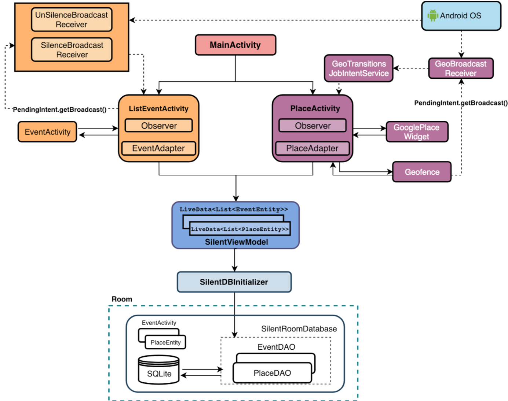

## Usage
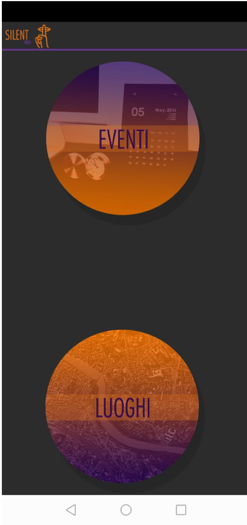 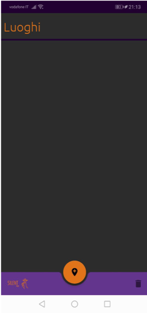 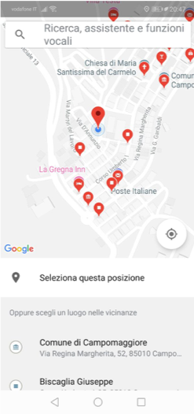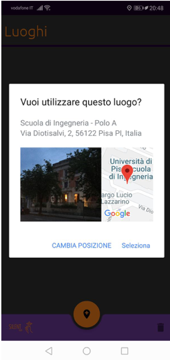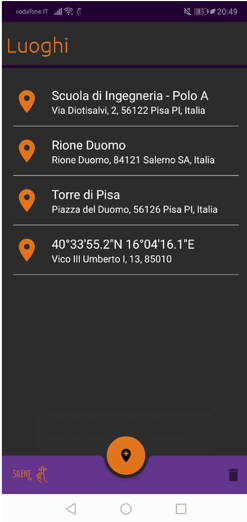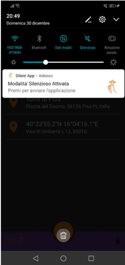 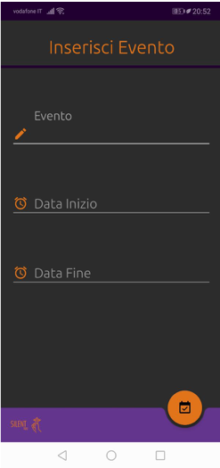 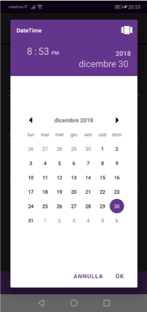 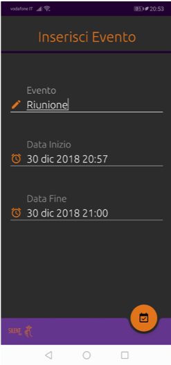 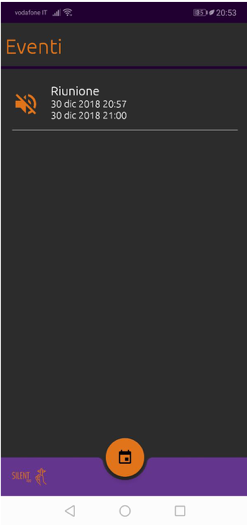 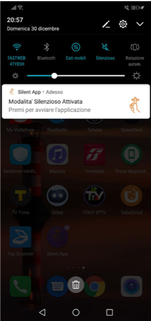 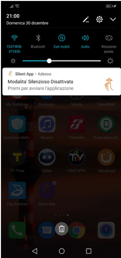

### Powered by
 
